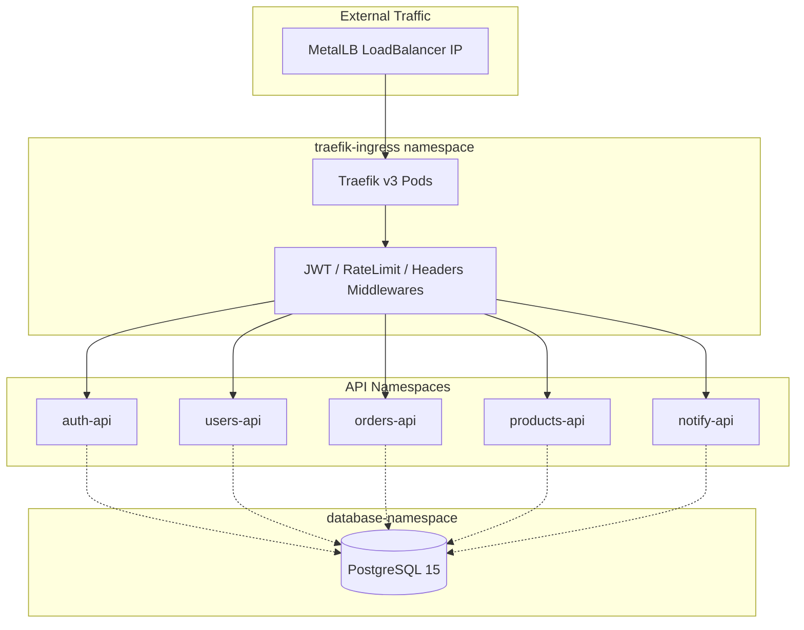

# Nitroberry Bare Metal Kubernetes Architecture

A production-ready, multi-namespace Kubernetes architecture designed for bare-metal environments. This setup leverages **Traefik v3** as the Ingress Controller, **MetalLB** for LoadBalancing, and **PostgreSQL 15** as a shared, multi-schema database.

## � Quick Start for Beginners

If you're new to Kubernetes deployment, follow these steps in order:

1. **Set up your production VM** with Kubernetes (see Prerequisites below)
2. **Clone this repository** and navigate to the directory
3. **Configure values** for your environment (see Production Configuration section)
4. **Deploy step by step** using the commands in Deployment Guide
5. **Verify deployment** with the provided verification commands

> [!TIP]
> This setup is designed for production use. Make sure you have a running Kubernetes cluster before proceeding.

## �🏗️ Architecture Overview

The system is architected for high isolation and scalability. Each core service resides in its own dedicated namespace, protected by strict Network Policies.



## 🚀 Service Grid

| Service | Namespace | Subdomain | Port | Protected Paths |
|---------|-----------|-----------|------|-----------------|
| **auth-api** | auth-namespace | `auth.yourdomain.com` | 8080 | All except `/login`, `/health` |
| **users-api** | users-namespace | `users.yourdomain.com` | 8080 | All except `/health` |
| **orders-api** | orders-namespace | `orders.yourdomain.com` | 8080 | All except `/health` |
| **products-api** | products-namespace | `products.yourdomain.com` | 8080 | All except `/health` |
| **notify-api** | notify-namespace | `notify.yourdomain.com` | 8080 | All except `/health` |

## 🛠️ Prerequisites

- **Kubernetes Cluster**: Production bare-metal setup on VM (Ubuntu/Debian recommended). No Minikube required.
- **MetalLB**: Installed and configured with your VM's IP range.
- **kubectl**: Configured with cluster-admin access to the production cluster.
- **Helm**: Package manager for Kubernetes (install via included script).
- **Domain DNS**: Pointing `*.yourdomain.com` to your MetalLB LoadBalancer IP.
- **SSL Certificate**: Let's Encrypt will automatically provision via Traefik (ensure port 80/443 accessible).

### Production VM Setup Checklist

Before deploying, ensure your VM has:
- ✅ Kubernetes control plane running (kubelet, kube-apiserver, etc.)
- ✅ MetalLB installed via Helm or manifests
- ✅ Network policies enabled
- ✅ Persistent storage available (for PostgreSQL and Traefik ACME)
- ✅ Firewall allowing traffic on ports 80, 443, and your service ports
- ✅ DNS A records for `*.yourdomain.com` pointing to LoadBalancer IP

#### 🚀 Setting up Kubernetes on Ubuntu VM (For Beginners)

If you don't have Kubernetes running yet, here's how to set it up on a fresh Ubuntu VM:

```bash
# Update system
sudo apt update && sudo apt upgrade -y

# Install Docker (required for Kubernetes)
sudo apt install -y docker.io
sudo systemctl start docker
sudo systemctl enable docker

# Install Kubernetes components
sudo apt install -y apt-transport-https ca-certificates curl
curl -fsSL https://packages.cloud.google.com/apt/doc/apt-key.gpg | sudo gpg --dearmor -o /usr/share/keyrings/kubernetes-archive-keyring.gpg
echo "deb [signed-by=/usr/share/keyrings/kubernetes-archive-keyring.gpg] https://apt.kubernetes.io/ kubernetes-xenial main" | sudo tee /etc/apt/sources.list.d/kubernetes.list
sudo apt update
sudo apt install -y kubelet kubeadm kubectl
sudo systemctl start kubelet
sudo systemctl enable kubelet

# Initialize Kubernetes cluster (run only on master node)
sudo kubeadm init --pod-network-cidr=10.244.0.0/16

# Set up kubectl for your user
mkdir -p $HOME/.kube
sudo cp -i /etc/kubernetes/admin.conf $HOME/.kube/config
sudo chown $(id -u):$(id -g) $HOME/.kube/config

# Install network plugin (Calico)
kubectl apply -f https://docs.projectcalico.org/manifests/calico.yaml

# Install MetalLB (load balancer)
kubectl apply -f https://raw.githubusercontent.com/metallb/metallb/v0.13.12/config/manifests/metallb-native.yaml

# Wait for MetalLB to be ready, then create IPAddressPool (see 01-metallb.yaml)
```

> [!NOTE]
> For multi-node clusters, join worker nodes using the `kubeadm join` command provided after `kubeadm init`.

### Installing Helm

This repository includes the official Helm installation script (`get_helm.sh`) for convenience. Helm is required for advanced Kubernetes package management and can be used to deploy additional components.

#### Quick Install (Latest Version)
```bash
chmod +x get_helm.sh
./get_helm.sh
```

#### Install Specific Version
```bash
chmod +x get_helm.sh
./get_helm.sh --version v3.14.0
```

#### Install Without Sudo (if you have write access to `/usr/local/bin`)
```bash
chmod +x get_helm.sh
./get_helm.sh --no-sudo
```

#### Script Options
- `--version|-v <version>`: Install a specific Helm version (e.g., `v3.14.0` or `canary`)
- `--no-sudo`: Install without using sudo (requires write access to install directory)
- `--help|-h`: Display help information

#### Environment Variables
The script supports the following environment variables for customization:
- `BINARY_NAME`: Name of the binary to install (default: `helm`)
- `USE_SUDO`: Whether to use sudo for installation (default: `true`)
- `DEBUG`: Enable debug output (default: `false`)
- `VERIFY_CHECKSUM`: Verify SHA256 checksums (default: `true`)
- `VERIFY_SIGNATURES`: Verify GPG signatures (Linux only, default: `false`)
- `HELM_INSTALL_DIR`: Installation directory (default: `/usr/local/bin`)

#### Verification
After installation, verify Helm is working:
```bash
helm version
```

#### Troubleshooting
- **Permission Denied**: Use `--no-sudo` if you have write access to `/usr/local/bin`, or run with `sudo`
- **Unsupported OS/Arch**: The script supports Linux, macOS, and Windows on common architectures
- **Network Issues**: Ensure outbound HTTPS access to `get.helm.sh`
- **Checksum Verification Fails**: Set `VERIFY_CHECKSUM=false` to skip checksum verification
- **GPG Verification**: Set `VERIFY_SIGNATURES=true` for enhanced security (Linux only, requires `gpg`)

## 📦 Deployment Guide

Deploy the manifests in sequential order to ensure dependencies (namespaces, RBAC, etc.) are met.
### Step 0: Configure for Your Environment
```bash
# Option 1: Use the automated configuration script
./configure.sh

# Option 2: Manual configuration (see Production Configuration Values section)
# Edit the variables in configure.sh and run it
```
### 1. Initialize Namespaces & Network
```bash
kubectl apply -f 00-namespaces.yaml
kubectl apply -f 01-metallb.yaml
```
> [!IMPORTANT]
> Edit `01-metallb.yaml` to set your production VM's IP range before applying. Also update all domains, passwords, and image references as listed in the Production Configuration Values section.

### 2. Deploy Shared Database
```bash
kubectl apply -f 02-postgres.yaml
```
*Creates PostgreSQL 15 with automated schema creation for all 5 services.*

### 3. Setup Traefik Ingress Controller
```bash
kubectl apply -f 03-traefik-rbac.yaml
kubectl apply -f 04-traefik-install.yaml
kubectl apply -f 05-traefik-middlewares.yaml
```
*Traefik v3 is deployed with Let's Encrypt (TLS-ALPN-01) and JWT validation plugins.*

### 4. Deploy API Services
```bash
kubectl apply -f 06-auth-api.yaml
kubectl apply -f 07-users-api.yaml
kubectl apply -f 08-orders-api.yaml
kubectl apply -f 09-products-api.yaml
kubectl apply -f 10-notify-api.yaml
```

## ⚙️ Production Configuration Values

> [!WARNING]
> **CRITICAL**: Before deploying, you MUST update these values to match your environment. Failure to do so will result in deployment failures or security issues.

### 1. MetalLB IP Address Pool (`01-metallb.yaml`)
**What to change**: The IP range that MetalLB will use for LoadBalancer services.
**Current value**: `192.168.49.200-192.168.49.250` (Minikube default)
**What to set**: Your VM's available IP range (e.g., `10.0.0.100-10.0.0.150`)
**Where**: Line 7 in `01-metallb.yaml`
```yaml
spec:
  addresses:
  - 192.168.49.200-192.168.49.250 # CHANGE THIS TO YOUR IP RANGE
```

### 2. Domain Names (All API YAML files: `06-auth-api.yaml` through `10-notify-api.yaml`)
**What to change**: All subdomain references from `nitroberry.com` to your actual domain.
**Files to update**:
- `06-auth-api.yaml`: Change `auth.nitroberry.com` to `auth.yourdomain.com`
- `07-users-api.yaml`: Change `users.nitroberry.com` to `users.yourdomain.com`
- `08-orders-api.yaml`: Change `orders.nitroberry.com` to `orders.yourdomain.com`
- `09-products-api.yaml`: Change `products.nitroberry.com` to `products.yourdomain.com`
- `10-notify-api.yaml`: Change `notify.nitroberry.com` to `notify.yourdomain.com`

**Where**: In each file, look for `match: Host(` lines in the IngressRoute specs.

### 3. Let's Encrypt Email (`04-traefik-install.yaml`)
**What to change**: Email address for SSL certificate notifications.
**Current value**: `admin@nitroberry.com`
**What to set**: Your actual email (e.g., `admin@yourdomain.com`)
**Where**: Line 43 in `04-traefik-install.yaml`
```yaml
- --certificatesresolvers.myresolver.acme.email=admin@nitroberry.com
```

### 4. Database Password
**What to change**: PostgreSQL password for security.
**Current value**: `nitroberry-secret-password`
**What to set**: A strong, unique password (e.g., `YourSecurePass123!`)
**Files to update**:
- `02-postgres.yaml`: Line 8 (Secret definition)
- `06-auth-api.yaml`: Line 23 (DATABASE_URL)
- `07-users-api.yaml`: Line 23 (DATABASE_URL)
- `08-orders-api.yaml`: Line 23 (DATABASE_URL)
- `09-products-api.yaml`: Line 23 (DATABASE_URL)
- `10-notify-api.yaml`: Line 23 (DATABASE_URL)

### 5. Container Images (All API YAML files: `06-10-*.yaml`)
**What to change**: Placeholder image references to your actual container images.
**Current values**:
- `nitroberry/auth-api:latest`
- `nitroberry/users-api:latest`
- `nitroberry/orders-api:latest`
- `nitroberry/products-api:latest`
- `nitroberry/notify-api:latest`

**What to set**: Your container registry images (e.g., `yourregistry.com/auth-api:v1.0.0`)
**Where**: In each API YAML file, look for the `image:` field in the container spec.

### 🔧 Automated Configuration Script

A configuration script `configure.sh` is provided to automatically update all production values. Simply edit the variables at the top of the script and run it:

```bash
chmod +x configure.sh
./configure.sh
```

This script will update:
- MetalLB IP ranges
- Domain names across all files
- Let's Encrypt email
- Database passwords
- Container image references

## 🔒 Security & Scaling

### Middlewares
- **JWT Validation**: Centralized validation at the Ingress level using Traefik plugins.
- **Rate Limiting**: Globally capped at 100 requests/sec per service.
- **Security Headers**: HSTS, XSS Protection, and No-Sniff enabled by default.

### Networking
- **Namespace Isolation**: Each namespace has a `NetworkPolicy` allowing ONLY Traefik traffic (Ingress) and ONLY PostgreSQL traffic (Egress).

### Autoscaling (HPA)
- **Min Replicas**: 2
- **Max Replicas**: 10
- **Threshold**: Scales when CPU utilization exceeds 70%.

## 🔍 Verification

Check the status of all resources:
```bash
kubectl get pods -A
kubectl get svc -n traefik-ingress
kubectl get hpa -A
```

Verify DB connectivity from an API pod:
```bash
kubectl exec -it <pod_name> -n auth-namespace -- psql -h postgres-service.database-namespace.svc.cluster.local -U postgres
```

## 🐛 Troubleshooting Guide

### Common Issues and Solutions

#### 1. **Pods Not Starting**
```bash
# Check pod status
kubectl get pods -A

# Check pod logs
kubectl logs <pod-name> -n <namespace>

# Check events
kubectl get events -A
```

#### 2. **MetalLB Not Assigning IPs**
```bash
# Check MetalLB pods
kubectl get pods -n metallb-system

# Check IPAddressPool
kubectl get ipaddresspool -n metallb-system

# Check LoadBalancer services
kubectl get svc -A | grep LoadBalancer
```

#### 3. **Traefik Not Routing Traffic**
```bash
# Check Traefik dashboard (if enabled)
kubectl port-forward -n traefik-ingress svc/traefik-service 8080:8080

# Check IngressRoute resources
kubectl get ingressroute -A

# Check Traefik logs
kubectl logs -n traefik-ingress deployment/traefik
```

#### 4. **SSL Certificate Issues**
```bash
# Check certificate status
kubectl get certificates -A

# Check Traefik ACME logs
kubectl logs -n traefik-ingress deployment/traefik | grep acme
```

#### 5. **Database Connection Issues**
```bash
# Check PostgreSQL pod
kubectl get pods -n database-namespace

# Check database logs
kubectl logs -n database-namespace deployment/postgres

# Test connection from a pod
kubectl run test-connection --image=postgres:15 --rm -it -- psql -h postgres-service.database-namespace.svc.cluster.local -U postgres
```

#### 6. **DNS Resolution Problems**
```bash
# Test DNS resolution
nslookup auth.yourdomain.com

# Check DNS A records point to LoadBalancer IP
dig A auth.yourdomain.com
```

#### 7. **Image Pull Errors**
```bash
# Check if images exist in your registry
docker pull yourregistry.com/auth-api:v1.0.0

# Check image pull secrets if using private registry
kubectl get secrets -A | grep registry
```

#### 8. **Network Policy Issues**
```bash
# Check network policies
kubectl get networkpolicy -A

# Test connectivity between namespaces
kubectl run test --image=busybox --rm -it -- nslookup postgres-service.database-namespace.svc.cluster.local
```

### Quick Health Check Script
```bash
#!/bin/bash
echo "=== Nitroberry Health Check ==="

echo "1. Checking cluster status..."
kubectl cluster-info

echo "2. Checking nodes..."
kubectl get nodes

echo "3. Checking pods..."
kubectl get pods -A

echo "4. Checking services..."
kubectl get svc -A

echo "5. Checking MetalLB..."
kubectl get ipaddresspool -n metallb-system

echo "6. Checking Traefik..."
kubectl get pods -n traefik-ingress

echo "7. Checking databases..."
kubectl get pods -n database-namespace

echo "8. Checking API services..."
kubectl get pods -n auth-namespace
kubectl get pods -n users-namespace
kubectl get pods -n orders-namespace
kubectl get pods -n products-namespace
kubectl get pods -n notify-namespace

echo "=== Health check complete ==="
```

### Getting Help
- Check Kubernetes logs: `kubectl logs <resource> -n <namespace>`
- Use `kubectl describe` for detailed resource information
- Verify your configuration values match the Production Configuration section
- Ensure DNS is properly configured and propagated
