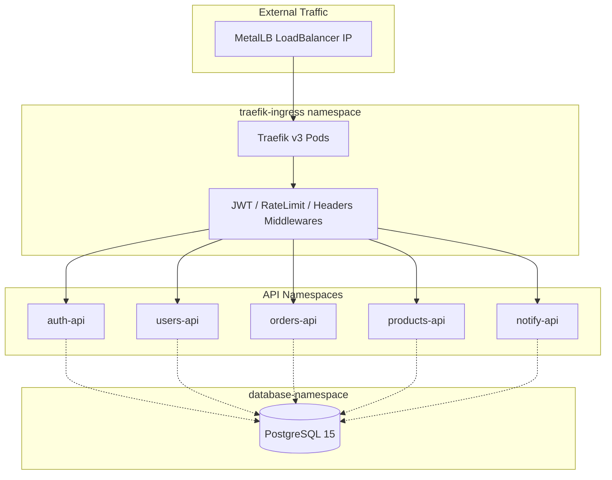

# Nitroberry Bare Metal Kubernetes Architecture

A production-ready, multi-namespace Kubernetes architecture designed for bare-metal environments. This setup leverages **Traefik v3** as the Ingress Controller, **MetalLB** for LoadBalancing, and **PostgreSQL 15** as a shared, multi-schema database.

## 🏗️ Architecture Overview

The system is architected for high isolation and scalability. Each core service resides in its own dedicated namespace, protected by strict Network Policies.



## 🚀 Service Grid

| Service | Namespace | Subdomain | Port | Protected Paths |
|---------|-----------|-----------|------|-----------------|
| **auth-api** | auth-namespace | `auth.nitroberry.com` | 8080 | All except `/login`, `/health` |
| **users-api** | users-namespace | `users.nitroberry.com` | 8080 | All except `/health` |
| **orders-api** | orders-namespace | `orders.nitroberry.com` | 8080 | All except `/health` |
| **products-api** | products-namespace | `products.nitroberry.com` | 8080 | All except `/health` |
| **notify-api** | notify-namespace | `notify.nitroberry.com` | 8080 | All except `/health` |

## 🛠️ Prerequisites

- **Kubernetes Cluster**: Bare metal setup (Ubuntu/Debian recommended).
- **MetalLB**: Installed (but not configured).
- **kubectl**: Configured with cluster-admin access.
- **Domain DNS**: Pointing `*.nitroberry.com` to your MetalLB IP range.

## 📦 Deployment Guide

Deploy the manifests in sequential order to ensure dependencies (namespaces, RBAC, etc.) are met.

### 1. Initialize Namespaces & Network
```bash
kubectl apply -f 00-namespaces.yaml
kubectl apply -f 01-metallb.yaml
```
> [!IMPORTANT]
> Edit `01-metallb.yaml` to set your local IP range before applying.

### 2. Deploy Shared Database
```bash
kubectl apply -f 02-postgres.yaml
```
*Creates PostgreSQL 15 with automated schema creation for all 5 services.*

### 3. Setup Traefik Ingress Controller
```bash
kubectl apply -f 03-traefik-rbac.yaml
kubectl apply -f 04-traefik-install.yaml
kubectl apply -f 05-traefik-middlewares.yaml
```
*Traefik v3 is deployed with Let's Encrypt (TLS-ALPN-01) and JWT validation plugins.*

### 4. Deploy API Services
```bash
kubectl apply -f 06-auth-api.yaml
kubectl apply -f 07-users-api.yaml
kubectl apply -f 08-orders-api.yaml
kubectl apply -f 09-products-api.yaml
kubectl apply -f 10-notify-api.yaml
```

## 🔒 Security & Scaling

### Middlewares
- **JWT Validation**: Centralized validation at the Ingress level using Traefik plugins.
- **Rate Limiting**: Globally capped at 100 requests/sec per service.
- **Security Headers**: HSTS, XSS Protection, and No-Sniff enabled by default.

### Networking
- **Namespace Isolation**: Each namespace has a `NetworkPolicy` allowing ONLY Traefik traffic (Ingress) and ONLY PostgreSQL traffic (Egress).

### Autoscaling (HPA)
- **Min Replicas**: 2
- **Max Replicas**: 10
- **Threshold**: Scales when CPU utilization exceeds 70%.

## 🔍 Verification

Check the status of all resources:
```bash
kubectl get pods -A
kubectl get svc -n traefik-ingress
kubectl get hpa -A
```

Verify DB connectivity from an API pod:
```bash
kubectl exec -it <pod_name> -n auth-namespace -- psql -h postgres-service.database-namespace.svc.cluster.local -U postgres
```
